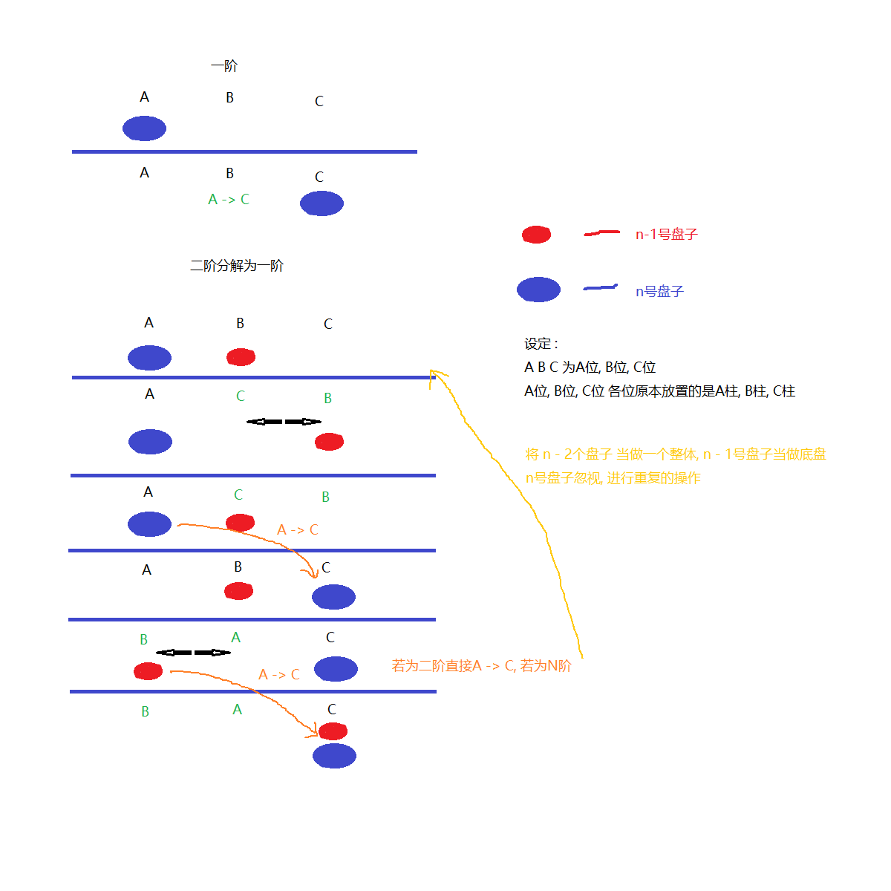

关于汉诺塔 : 
A(起始位) , B(辅助位) , C(目标位) 三个位置 , 每个位置一根柱子 , A 位有从上至下N阶逐渐变大的盘子 , 需求是从A位经过B位辅助 , 获取C位辅助 , 最终在C位自上而下按照大小排列 , 且过程中大盘永远必须在小盘下.
思路一 :

思路二 :

```python
def hanoi(n, A, B, C):
    if n > 0:
        hanoi(n - 1, A, C, B)  # B C换位
        print('%s -> %s' % (A, C))
        hanoi(n - 1, B, A, C)  # A B换位
一阶汉诺塔中, 直接

hanoi(4, 'A', 'B', 'C')
```
